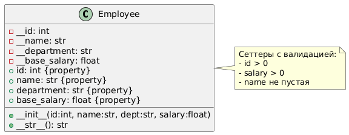
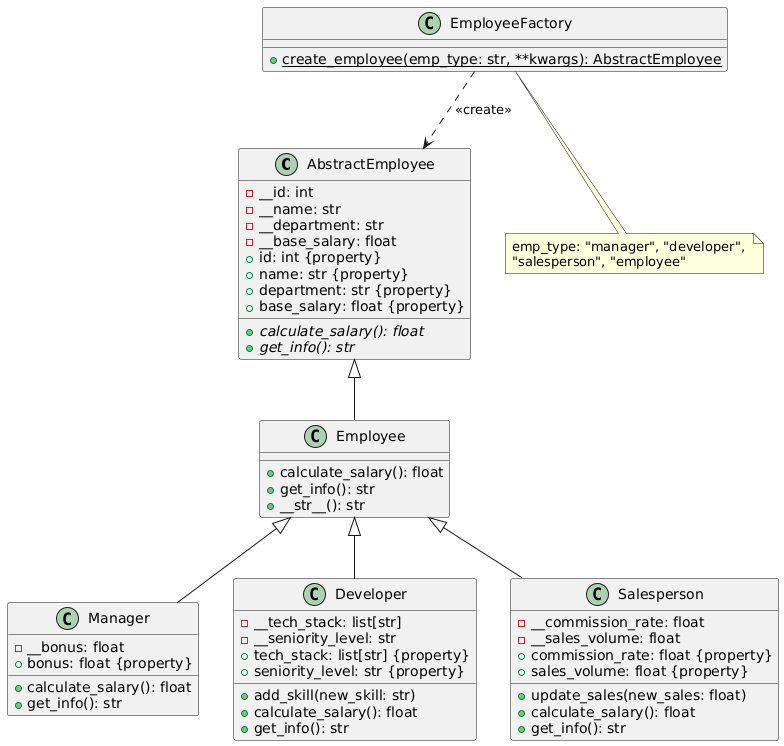
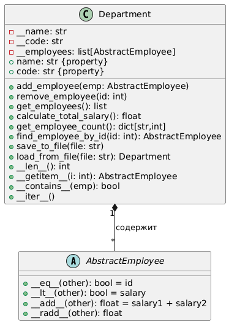
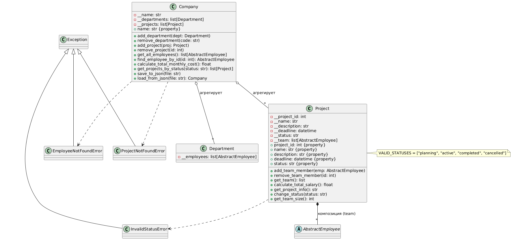

# Отчёт по лабораторной работе

**Тема:** Реализация принципов ООП на примере системы учета сотрудников

## Сведения о студенте

**Дата:** 2025-09-04  
**Семестр:** 2 курс, 1 полугодие (3 семестр)  
**Группа:** ПИН-б-о-24-1  
**Дисциплина:** Технологии программирования  
**Студент:** Куйбышев Александр Максимович  

### Цель работы

Разработка комплексной системы учета сотрудников компании с применением всех принципов объектно-ориентированного программирования.

### Структура проекта

```
lab4/
├── report.md
├── task.md
├── project/
│   ├── employee.py           # 4.1 
│   ├── employee_hierarchy.py # 4.2
│   ├── department.py         # 4.3 
│   └── project.py            # 4.4
└── report/
    └──*.png
```
## Часть 4.1: Инкапсуляция

Реализация базового класса `Employee` с инкапсуляцией данных и валидацией.
Выполненные задачи

- Создан класс `Employee` с приватными атрибутами
- Реализованы свойства (property) для доступа к данным
- Добавлена валидация входных параметров
- Реализован метод `__str__` для строкового представления

### Ключевые элементы реализации

```py
class Employee:
    def __init__(self, id: int, name: str, department: str, base_salary: float):
        self.__id = id
        self.__name = name
        self.__department = department
        self.__base_salary = base_salary
    
    @property
    def id(self):
        return self.__id
    
    @id.setter
    def id(self, value):
        if value <= 0:
            raise ValueError('ID должен быть положительным')
        self.__id = value
    
    @property
    def name(self):
        return self.__name
    
    @name.setter
    def name(self, value):
        if not value.strip():
            raise ValueError('Имя не может быть пустым')
        self.__name = value
    
    @property
    def base_salary(self):
        return self.__base_salary
    
    @base_salary.setter
    def base_salary(self, value):
        if value <= 0:
            raise ValueError('Зарплата должна быть положительной')
        self.__base_salary = value

    def __str__(self) -> str:
        return f"Сотрудник [id: {self.__id}, имя: {self.__name}, отдел: {self.__department}, базовая зарплата: {self.__base_salary}]"

```
#### Результаты тестирования
- Протестирована корректная установка и получение значений
- Проверена обработка невалидных данных (выбрасываются исключения)
- Убедились в корректности строкового представления
#### Пример использования
```py
emp = Employee(1, "Иван Иванов", "Бухгалтерия", 50000)
print(emp) 
# Сотрудник [id: 1, имя: Иван Иванов, отдел: Бухгалтерия, базовая зарплата: 50000]
```
#### Диаграмма классов


## Часть 4.2: Наследование и абстракция

Создание иерархии классов сотрудников на основе наследования и абстракции.

### Ключевая реализация
```python
from abc import ABC, abstractmethod
from typing import List

class AbstractEmployee(ABC):
    @abstractmethod
    def calculate_salary(self) -> float:
        pass
    
    @abstractmethod
    def get_info(self) -> str:
        pass

class Employee(AbstractEmployee):
    def __init__(self, id: int, name: str, department: str, base_salary: float):
        self.__id = id
        self.__name = name
        self.__department = department
        self.__base_salary = base_salary

    def calculate_salary(self) -> float:
        return self.__base_salary

    def get_info(self) -> str:
        return f"{self.__str__()}, зарплата: {self.calculate_salary()}"

class Manager(Employee):
    def __init__(self, id: int, name: str, department: str, base_salary: float, bonus: float):
        super().__init__(id, name, department, base_salary)
        self.__bonus = bonus

    def calculate_salary(self) -> float:
        return super().calculate_salary() + self.__bonus

class Developer(Employee):
    def __init__(self, id: int, name: str, department: str, base_salary: float, 
                 tech_stack: List[str], seniority: str):
        super().__init__(id, name, department, base_salary)
        self.__tech_stack = tech_stack
        self.__seniority = seniority

    def calculate_salary(self) -> float:
        coeff = {"junior": 1.0, "middle": 1.5, "senior": 2.0}
        return super().calculate_salary() * coeff.get(self.__seniority, 1.0)

class EmployeeFactory:
    @staticmethod
    def create_employee(emp_type: str, **kwargs) -> AbstractEmployee:
        if emp_type == "manager":
            return Manager(**kwargs)
        elif emp_type == "developer":
            return Developer(**kwargs)
        elif emp_type == "employee":
            return Employee(**kwargs)
        raise ValueError(f"Неизвестный тип: {emp_type}")
```


#### Выполненные задачи
- Создан абстрактный класс `AbstractEmployee`
- Реализованы классы-наследники: `Manager`, `Developer`, `Salesperson`
- Реализована фабрика сотрудников `EmployeeFactory`
- Переопределены методы расчета зарплат


#### Пример использования

```python
manager = EmployeeFactory.create_employee("manager", id=2, name="Петр Петров", 
                                         department="Менеджмент", base_salary=70000, bonus=20000)
print(manager.calculate_salary())  
# 90000.0
```
#### Диаграмма классов


## Часть 4.3: Полиморфизм и магические методы
### Ключевая реализация
```python
from typing import List, Dict, Optional

class Department:
    def __init__(self, name: str, code: str):
        self.__name = name
        self.__code = code
        self.__employees: List[AbstractEmployee] = []

    def add_employee(self, employee: AbstractEmployee) -> None:
        self.__employees.append(employee)

    def remove_employee(self, employee_id: int) -> None:
        self.__employees = [emp for emp in self.__employees if emp.id != employee_id]

    def calculate_total_salary(self) -> float:
        return sum(emp.calculate_salary() for emp in self.__employees)

    def get_employee_count(self) -> Dict[str, int]:
        counts = {}
        for emp in self.__employees:
            cls_name = emp.__class__.__name__
            counts[cls_name] = counts.get(cls_name, 0) + 1
        return counts

    def __len__(self) -> int:
        return len(self.__employees)

    def __getitem__(self, key: int) -> AbstractEmployee:
        return self.__employees[key]

    def __contains__(self, employee: AbstractEmployee) -> bool:
        return employee in self.__employees

    def __iter__(self):
        return iter(self.__employees)

```
Реализация полиморфного поведения и перегрузки операторов.
#### Выполненные задачи
- Создан класс `Department` для управления сотрудниками
- Реализованы магические методы для сотрудников и отделов
- Добавлена поддержка сериализации/десериализации
- Реализована итерация по объектам

#### Примеры реализации

```python
dept = Department("IT", "DEV")
dept.add_employee(manager)
dept.add_employee(developer)
print(dept.calculate_total_salary()) 
print(len(dept))
 # 180000.0
 # 2
for emp in dept:
    print(emp.get_info())
```
#### Диаграмма классов


## Часть 4.4: Композиция и агрегация

Построение сложных объектных структур с использованием композиции и агрегации.

### Ключевая реализация

```python
from typing import List
from datetime import datetime

class Project:
    VALID_STATUSES = ["planning", "active", "completed", "cancelled"]

    def __init__(self, project_id: int, name: str, description: str, 
                 deadline: str, status: str = "planning"):
        self.__project_id = project_id
        self.__name = name
        self.__description = description
        self.__deadline = datetime.strptime(deadline, "%Y-%m-%d")
        if status not in self.VALID_STATUSES:
            raise ValueError(f"Неверный статус: {status}")
        self.__status = status
        self.__team: List[AbstractEmployee] = []

    @property
    def project_id(self):
        return self.__project_id

    @property
    def status(self):
        return self.__status

    @status.setter
    def status(self, value):
        if value not in self.VALID_STATUSES:
            raise ValueError(f"Неверный статус: {value}")
        self.__status = value

    def add_team_member(self, employee: AbstractEmployee) -> None:
        self.__team.append(employee)

    def calculate_total_salary(self) -> float:
        return sum(emp.calculate_salary() for emp in self.__team)

class Company:
    def __init__(self, name: str):
        self.__name = name
        self.__departments: List[Department] = []
        self.__projects: List[Project] = []

    def add_department(self, dept: Department) -> None:
        self.__departments.append(dept)

    def add_project(self, project: Project) -> None:
        self.__projects.append(project)

    def calculate_total_monthly_cost(self) -> float:
        total = 0
        for dept in self.__departments:
            total += dept.calculate_total_salary()
        return total
```
#### Выполненные задачи
- Создан класс `Project` с композицией сотрудников
- Реализован класс `Company` с агрегацией отделов и проектов
- Добавлена система валидации и кастомные исключения
- Реализована комплексная сериализация системы

#### Примеры реализации

```python
project = Project(101, "AI Platform", "AI система", "2025-12-31", "active")
project.add_team_member(developer)
company = Company("TechInnovations")
company.add_project(project)
print(company.calculate_total_monthly_cost())
```
#### Диаграмма классов


## Выводы

1. ООП делает код гибким и понятным - абстракция и наследование помогают создавать иерархии объектов (сотрудники разных типов), композиция и агрегация управляют связями между ними (отделы, проекты).

2. Паттерны решают типовые проблемы - фабрика создает объекты, исключения обрабатывают ошибки, полиморфизм позволяет работать с разными объектами одинаково.

3. Хорошая архитектура экономит время - система с сериализацией, валидацией и отчетами из учебного примера становится готовым решением для реального учета сотрудников в компании.

## Список использованных источников

- [Документация Python](https://docs.python.org/3/)
- [PlantUML для UML-диаграмм](https://plantuml.com/ru/)
