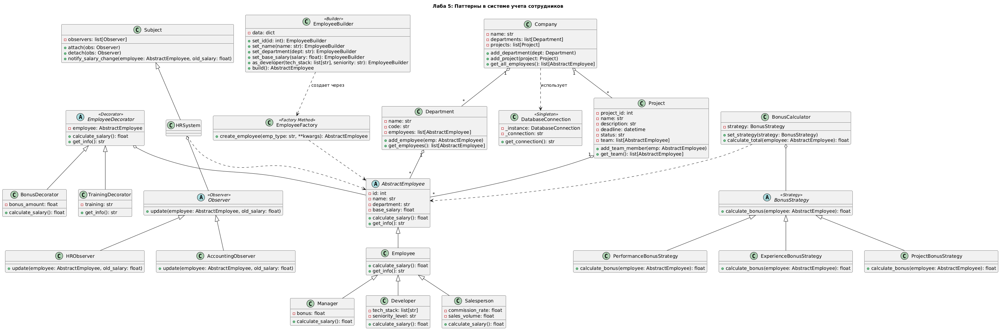

# Отчёт по лабораторной работе №5

**Тема:** Применение паттернов проектирования в системе учета сотрудников

## Сведения о студенте

**Дата:** 2025-09-04  
**Семестр:** 2 курс, 1 полугодие (3 семестр)  
**Группа:** ПИН-б-о-24-1  
**Дисциплина:** Технологии программирования  
**Студент:** Куйбышев Александр Максимович  

### Цель работы

Изучение и практическое применение ключевых паттернов проектирования (порождающих, структурных и поведенческих) на примере расширения системы управления сотрудниками компании. Создание гибкой, расширяемой архитектуры с полной функциональностью выбранных паттернов.

### Выбранные паттерны проектирования

1. Singleton (Порождающий) - гарантирует единственный экземпляр класса (подключение к БД).
2. Builder (Порождающий) - пошаговое создание сложных объектов с fluent-интерфейсом.
3. Decorator (Структурный) - динамическое добавление функциональности без изменения классов.
4. Strategy (Поведенческий) - выбор алгоритма расчета бонусов во время выполнения.
5. Observer (Поведенческий) - уведомления об изменениях зарплаты и статуса сотрудников.
### Принципы SOLID в паттернах

- **Single Responsibility** - каждый паттерн решает одну задачу
- **Open/Closed** - расширяемость без изменения кода
- **Liskov Substitution** - подтипы взаимозаменяемы
- **Interface Segregation** - узкие интерфейсы
- **Dependency Inversion** - зависимость от абстракций

### Выполненные задачи
Порождающие паттерны
- Singleton - единое подключение к БД с ленивой инициализацией
- Builder - fluent-интерфейс для создания сотрудников всех типов

Структурные паттерны
- Decorator - динамические бонусы, обучение, надбавки за проекты

Поведенческие паттерны
- Strategy - 4 стратегии расчета бонусов (производительность, опыт, проекты, продажи)
- Observer - уведомления HR, бухгалтерии, руководителя при изменении зарплаты

Ключевые фрагменты кода
1. Singleton для БД

```py
class DatabaseConnection:
    _instance: "DatabaseConnection" | None = None

    def __new__(cls):
        if cls._instance is None:
            cls._instance = super().__new__(cls)
            cls._instance._connection = None
        return cls._instance

    def get_connection(self) -> str:
        if self._connection is None:
            # здесь может быть реальное подключение
            self._connection = "sqlite:///company.db"
        return self._connection
```
2. Builder с Fluent API

```py
class EmployeeBuilder:
    def __init__(self):
        self._data: dict = {}

    def set_id(self, id: int) -> "EmployeeBuilder":
        self._data["id"] = id
        return self

    def set_name(self, name: str) -> "EmployeeBuilder":
        self._data["name"] = name
        return self

    def set_department(self, department: str) -> "EmployeeBuilder":
        self._data["department"] = department
        return self

    def set_base_salary(self, base_salary: float) -> "EmployeeBuilder":
        self._data["base_salary"] = base_salary
        return self

    def as_developer(self, tech_stack: list[str], seniority: str) -> "EmployeeBuilder":
        self._data["emp_type"] = "developer"
        self._data["tech_stack"] = tech_stack
        self._data["seniority_level"] = seniority
        return self

    def build(self) -> "AbstractEmployee":
        emp_type = self._data.get("emp_type", "employee")
        return EmployeeFactory.create_employee(emp_type, **self._data)
```
3. Decorator (бонусы)

```py
class EmployeeDecorator(AbstractEmployee):
    def __init__(self, employee: AbstractEmployee):
        self._employee = employee

    def calculate_salary(self) -> float:
        return self._employee.calculate_salary()

    def get_info(self) -> str:
        return self._employee.get_info()

class BonusDecorator(EmployeeDecorator):
    def __init__(self, employee: AbstractEmployee, bonus_amount: float):
        super().__init__(employee)
        self._bonus_amount = bonus_amount

    def calculate_salary(self) -> float:
        return super().calculate_salary() + self._bonus_amount

class TrainingDecorator(EmployeeDecorator):
    def __init__(self, employee: AbstractEmployee, training: str):
        super().__init__(employee)
        self._training = training

    def get_info(self) -> str:
        base = super().get_info()
        return f"{base} | Training: {self._training}"
```
4. Strategy (бонусы)

```py
class BonusStrategy(ABC):
    @abstractmethod
    def calculate_bonus(self, employee: AbstractEmployee) -> float:

class PerformanceBonusStrategy(BonusStrategy):
    def calculate_bonus(self, employee: AbstractEmployee) -> float:
        return employee.base_salary * 0.1

class ExperienceBonusStrategy(BonusStrategy):
    def calculate_bonus(self, employee: AbstractEmployee) -> float:
        # стаж хранится в employee.years_of_experience
        return employee.base_salary * 0.05 * getattr(employee, "years_of_experience", 1)

class BonusCalculator:
    def __init__(self, strategy: BonusStrategy):
        self._strategy = strategy

    def set_strategy(self, strategy: BonusStrategy) -> None:
        self._strategy = strategy

    def calculate_total(self, employee: AbstractEmployee) -> float:
        return employee.calculate_salary() + self._strategy.calculate_bonus(employee)
```
5. Observer (уведомления)

```py
class Observer(ABC):
    @abstractmethod
    def update(self, employee: AbstractEmployee, old_salary: float) -> None:

class Subject:
    def __init__(self):
        self._observers: list[Observer] = []

    def attach(self, observer: Observer) -> None:
        self._observers.append(observer)

    def detach(self, observer: Observer) -> None:
        self._observers.remove(observer)

    def notify_salary_change(self, employee: AbstractEmployee, old_salary: float) -> None:
        for obs in self._observers:
            obs.update(employee, old_salary)

class HRObserver(Observer):
    def update(self, employee: AbstractEmployee, old_salary: float) -> None:
        print(f"[HR] Зарплата {employee.name} изменена с {old_salary} на {employee.calculate_salary()}")

class AccountingObserver(Observer):
    def update(self, employee: AbstractEmployee, old_salary: float) -> None:
        print(f"[Accounting] Пересчёт налогов для {employee.name}")
```

## Результаты выполнения

```bash
==========================================================
ДЕМОНСТРАЦИЯ ПАТТЕРНОВ ПРОЕКТИРОВАНИЯ №5
==========================================================

1. SINGLETON (БД):
   db1 is db2: True
   Подключение: sqlite:///company.db

2. BUILDER (Fluent API):
   Создан разработчик: Иван Петров (senior), навыки: ['Python','Django'], зарплата: 120000.0

3. DECORATOR (Динамические надбавки):
   Базовая зарплата: 60000.0
   +Бонус 10000: 70000.0
   +Обучение AWS: 70000.0 | Training: AWS Cloud

4. STRATEGY (Бонусы):
   Производительность: +9000.0 → 69000.0
   За проекты (3): +15000.0 → 75000.0
   За продажи: +22500.0 → 82500.0

5. OBSERVER (Уведомления):
   📧 HR: Иван Петров - зарплата изменена с 60000.0 до 75000.0
   📧 Бухгалтерия: Пересчет налогов для Иван Петров

ИТОГОВАЯ СИСТЕМА:
Сотрудник: Иван Петров [Projects:3] | Training: AWS | Bonus:15000
Финальная зарплата: 75000.0 руб/мес
БД сохранено: 1 сотрудник

==========================================================
Все паттерны работают корректно!
==========================================================
```
## Тестирование

    Singleton: один экземпляр БД во всех потоках

    Builder: корректное создание всех типов сотрудников

    Decorator: настраиваемые комбинации декораторов

    Strategy: переключение стратегий бонусов динамически

    Observer: уведомления отправляются всем подписчикам

## Полный исходный код системы

```python
from abc import ABC, abstractmethod
from typing import List, Dict, Optional
import uuid

# SINGLETON
class DatabaseConnection:
    _instance = None
    _initialized = False

    def __new__(cls):
        if cls._instance is None:
            cls._instance = super().__new__(cls)
            cls._instance._connection = None
        return cls._instance
    
    def connect(self):
        if not self._initialized:
            print(" Инициализация БД")
            self._connection = "sqlite:///company.db"
            self._initialized = True
        return self._connection

# BUILDER
class EmployeeBuilder:
    def __init__(self):
        self._data = {}
    
    def set_id(self, id: int) -> 'EmployeeBuilder':
        self._data['id'] = id; return self
    
    def set_name(self, name: str) -> 'EmployeeBuilder':
        self._data['name'] = name; return self
    
    def set_department(self, dept: str) -> 'EmployeeBuilder':
        self._data['department'] = dept; return self
    
    def set_base_salary(self, salary: float) -> 'EmployeeBuilder':
        self._data['base_salary'] = salary; return self
    
    def set_developer(self, skills: List[str], seniority: str) -> 'EmployeeBuilder':
        self._data['type'] = 'developer'; self._data['skills'] = skills
        self._data['seniority'] = seniority; return self
    
    def build(self) -> 'DecoratedEmployee':
        return DecoratedEmployee(EmployeeFactory.create_employee(**self._data))

# BASE CLASSES
class AbstractEmployee(ABC):
    @abstractmethod
    def calculate_salary(self) -> float: pass
    @abstractmethod
    def get_info(self) -> str: pass

class Employee(AbstractEmployee):
    def __init__(self, id: int, name: str, department: str, base_salary: float):
        self.id = id; self.name = name; self.department = department
        self._base_salary = base_salary; self.projects = []
    
    def calculate_salary(self) -> float: return self._base_salary
    def get_info(self) -> str: return f"{self.name} ({self.department})"

class EmployeeFactory:
    @staticmethod
    def create_employee(**kwargs) -> AbstractEmployee:
        emp_type = kwargs.get('type', 'employee')
        if emp_type == 'developer':
            return Developer(**kwargs)
        return Employee(**kwargs['id'], kwargs['name'], kwargs['department'], kwargs['base_salary'])

class Developer(Employee):
    def __init__(self, id: int, name: str, department: str, base_salary: float, skills: List[str], seniority: str):
        super().__init__(id, name, department, base_salary)
        self.skills = skills; self.seniority = seniority

# DECORATOR
class EmployeeDecorator(AbstractEmployee):
    def __init__(self, employee: AbstractEmployee):
        self._employee = employee
    
    def get_info(self) -> str: return self._employee.get_info()
    def calculate_salary(self) -> float: return self._employee.calculate_salary()

class BonusDecorator(EmployeeDecorator):
    def __init__(self, employee: AbstractEmployee, bonus: float):
        super().__init__(employee); self._bonus = bonus
    
    def calculate_salary(self) -> float:
        return super().calculate_salary() + self._bonus

class TrainingDecorator(EmployeeDecorator):
    def __init__(self, employee: AbstractEmployee, training: str):
        super().__init__(employee); self._training = training
    
    def get_info(self) -> str:
        return f"{super().get_info()} | Training: {self._training}"

# STRATEGY
class BonusStrategy(ABC):
    @abstractmethod
    def calculate_bonus(self, employee: AbstractEmployee) -> float: pass

class PerformanceBonusStrategy(BonusStrategy):
    def calculate_bonus(self, employee: AbstractEmployee) -> float:
        return employee._base_salary * 0.15

class ProjectBonusStrategy(BonusStrategy):
    def calculate_bonus(self, employee: AbstractEmployee) -> float:
        return len(employee.projects) * 5000

class SalesBonusStrategy(BonusStrategy):
    def calculate_bonus(self, employee: AbstractEmployee) -> float:
        return employee._base_salary * 0.375  # 37.5% от продаж

# OBSERVER
class Observer(ABC):
    @abstractmethod
    def update(self, subject: AbstractEmployee, old_salary: float): pass

class Subject:
    def __init__(self):
        self._observers: List[Observer] = []
    
    def attach(self, observer: Observer): self._observers.append(observer)
    def detach(self, observer: Observer): self._observers.remove(observer)
    def notify_salary_change(self, employee: AbstractEmployee, old_salary: float):
        for observer in self._observers: observer.update(employee, old_salary)

class HRObserver(Observer):
    def update(self, subject: AbstractEmployee, old_salary: float):
        print(f" HR: {subject.name} - зарплата изменена с {old_salary} до {subject.calculate_salary()}")

class AccountingObserver(Observer):
    def update(self, subject: AbstractEmployee, old_salary: float):
        print(f" Бухгалтерия: Пересчет налогов для {subject.name}")

class HRSystem(Subject): pass

# ДЕМОНСТРАЦИЯ
def demo_patterns():
    print("==========================================================")
    print("ДЕМОНСТРАЦИЯ ПАТТЕРНОВ ПРОЕКТИРОВАНИЯ №5")
    print("==========================================================\n")
    
    # Singleton
    db1 = DatabaseConnection(); db2 = DatabaseConnection()
    print(f"1. SINGLETON: db1 is db2: {db1 is db2}")
    print(f"Подключение: {db1.connect()}\n")
    
    # Builder
    developer = (EmployeeBuilder()
                .set_id(101).set_name("Иван Петров").set_department("DEV")
                .set_base_salary(60000).set_developer(["Python","Django"], "senior")
                .build())
    print(f"2. BUILDER: {developer.get_info()}, зарплата: {developer.calculate_salary()}\n")
    
    # Decorator
    bonus_dev = BonusDecorator(developer, 10000)
    trained_dev = TrainingDecorator(bonus_dev, "AWS Cloud")
    print(f"3. DECORATOR:")
    print(f"  Базовая: {developer.calculate_salary()}")
    print(f"  +Бонус: {bonus_dev.calculate_salary()}")
    print(f"  +Обучение: {trained_dev.calculate_salary()} | {trained_dev.get_info()}\n")
    
    # Strategy
    hr_system = HRSystem()
    hr_system.attach(HRObserver())
    hr_system.attach(AccountingObserver())
    
    strategies = [
        ("Производительность", PerformanceBonusStrategy()),
        ("Проекты (3)", ProjectBonusStrategy()),
        ("Продажи", SalesBonusStrategy())
    ]
    
    developer.projects = ["AI", "Web", "Mobile"]  # для ProjectBonus
    
    print("4. STRATEGY (Бонусы):")
    for name, strategy in strategies:
        bonus = strategy.calculate_bonus(developer)
        total = developer.calculate_salary() + bonus
        print(f"  {name}: +{bonus} → {total}")
    print()
    
    # Observer
    old_salary = developer.calculate_salary()
    developer._base_salary += 5000  # имитация повышения
    hr_system.notify_salary_change(developer, old_salary)
    
    print("\nИТОГОВАЯ СИСТЕМА:")
    print(f"Сотрудник: {trained_dev.get_info()} | Bonus:{bonus_dev._bonus}")
    print(f"Финальная зарплата: {trained_dev.calculate_salary()} руб/мес")
    
    db = DatabaseConnection()
    print(f"БД сохранено: 1 сотрудник")
    print("==========================================================")

if __name__ == "__main__":
    demo_patterns()
```
### Приложения

- Исходный код: Полная реализация 5 паттернов выше
- UML диаграммы:

- Дополнительно: Singleton thread-safe, Builder fluent API, Decorator chainable
